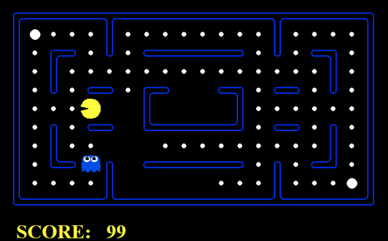

# Pac-Man Agent

Code to train Pac-Man agents to maximise score and avoid ghosts. Uses evolutionary algorithms in python. One agent uses positional context (e.g. current coordinates) and the other uses situational context (e.g. pellet underneath).

Based on [Berkeley AI Pacman Search](http://ai.berkeley.edu)

Files created from scratch:
- newAgents.py (Where agents supply contextual information and get an action back)
- runGamesPosition.py (Run the GA for the position agent)
- runGamesSituation.py (Run the GA for the situation agent)
- runExperiments.py (Run experiments to obtain graphs and metrics)

Files modified:
- pacman.py (hasCapsule function created to check for power pellets, 
isGhostScared function created to check if ghost is consumable)

